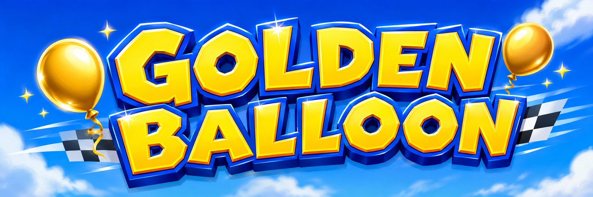

<p align="center">
  
</p>

<h1 align="center">Golden Balloon — PS Vita Port</h1>

<p align="center">
  A PS Vita port of <a href="https://github.com/akratch/goldenballoon">Golden Balloon</a>,
  itself a native and browser source port of the 1997 Nintendo 64 kart racer,
  built on the community
  <a href="https://github.com/DavidSM64/Diddy-Kong-Racing">decompilation</a>.<br>
  Not an emulator: the game is cross-compiled for the Vita and runs from a ROM
  you already own. No game assets are included.
</p>

<p align="center">
  <a href="https://github.com/akratch/goldenballoon"><b>⬆ Upstream project (Windows/macOS/Linux/browser)</b></a>
  &nbsp;·&nbsp;
  <a href="PORTING_STATUS.md"><b>📋 Full Vita port status &amp; known issues</b></a>
</p>

> **This is an unofficial PS Vita hardware port.** It is a fork of
> [akratch/goldenballoon](https://github.com/akratch/goldenballoon) that adds
> a PS Vita target on top of everything the upstream project already does.
> Everything in this document that isn't about the Vita applies equally to
> the upstream project — most of it is copied from their README, because
> most of the game hasn't changed. See [PORTING_STATUS.md](PORTING_STATUS.md)
> for the day-to-day truth about what currently works, what doesn't, and what
> is actively being debugged.
>
> **Status update (1.6.4):** the Restored visual preset is stable for normal
> play on tested real Vita hardware. The port boots, loads a ROM, renders 3D
> races and menus, saves progress, and includes a 98-trophy pack. The optional
> Remastered visual preset remains unsupported; use Restored (the default).
> The magic-code-gated Save Editor provides a supported way to test and repair
> Vita save progression.

## Quick start (PS Vita)

1. **Homebrew prerequisites.** Your Vita needs a homebrew-enabled firmware
   (H-Encore or similar) with [VitaShell](https://github.com/TheOfficialFloW/VitaShell)
   installed, and **`libshacccg.suprx`** present at `ur0:data/libshacccg.suprx`
   (Sony's proprietary runtime shader compiler — VitaShell can fetch it for
   you from its own menus, or use [shacccg-installer](https://github.com/Electry/shacccg.suprx-installer)).
   This port will not run without it. To use trophies, also install and enable
   [NoTrpDrm](https://github.com/Rinnegatamante/NoTrpDrm), which permits the
   unsigned homebrew trophy archive included with this VPK. Without NoTrpDrm,
   the game remains playable but trophies are safely unavailable.
2. **Get the ROM.** You need a legally acquired dump of the original game —
   US v1.0 (`v80`), as `.z64`. Copy it onto your Vita's memory card at
   exactly this path:

   ```text
   ux0:data/goldenballoon/baserom.us.v80.z64
   ```

   There is no in-app ROM picker on Vita yet (see
   [PORTING_STATUS.md](PORTING_STATUS.md)) — the engine looks for the ROM at
   that fixed path only.
3. **Install.** Copy `mdkr64.vpk` to your Vita (FTP via VitaShell, or a USB
   cable) and install it from VitaShell like any other VPK.
4. **Play.** A DualShock-style control layout is assumed; there is no
   in-game remapping UI on Vita yet.

**This is the 1.6.4 Vita release.** The default Restored visual preset is
stable for normal play on tested hardware. **Do not enable the Remastered
visual preset — it crashes on startup every time; this is a known,
still-unresolved issue, not something you did wrong.** If something else
breaks, check [PORTING_STATUS.md](PORTING_STATUS.md) first and consider
opening an issue with what you were doing when it happened.

## What Golden Balloon is (from the upstream project)

- **Widescreen** with the original FOV and art direction preserved, plus
  aspect, FOV, and supersampling controls.
- **High framerates without touching the game.** The simulation, physics,
  music, and lap times always run at their authored pace.
- **Local multiplayer** for 2–4 players, per-controller binding, split-screen
  (desktop only — see the Vita status table below).
- **Three extra racers.** Taj, Wizpig, and Terry are playable with their own
  identities and vehicles.
- **Saves that behave**: EEPROM progress, ghosts, and settings persist.

The full feature list — most of which the Vita port inherits unchanged from
the shared game/engine code — is in the
[upstream README](https://github.com/akratch/goldenballoon#features).

## Platforms

| Platform | Status |
|---|---|
| Windows (x64) | Upstream, stable — see [akratch/goldenballoon](https://github.com/akratch/goldenballoon) |
| macOS (Apple silicon) | Upstream, stable |
| Linux (x86-64) | Upstream, best effort |
| Browser (WebGPU) | Upstream, stable |
| **PS Vita** | **This fork, 1.6.4 — stable for normal play on the Restored visual preset, with 98 homebrew trophies and a built-in Save Editor. The Remastered preset crashes on startup and should not be used. See [PORTING_STATUS.md](PORTING_STATUS.md) for the exact current state.** |

## PS Vita: known limitations

This list is specific to the Vita target; upstream's own "Known limitations"
apply too where they overlap. See [PORTING_STATUS.md](PORTING_STATUS.md) for
the full, continuously-updated table (it also tracks every crash bug found
and fixed so far, with root causes).

- **Remastered visual preset crashes on startup — use Restored (default).**
  This is a known, actively-investigated issue with no fix yet; see
  [PORTING_STATUS.md's Known issues section](PORTING_STATUS.md#known-issues)
  for what's been ruled out so far.
- **No ROM picker.** The ROM must sit at the fixed path
  `ux0:data/goldenballoon/baserom.us.v80.z64`; only US v1.0 has been tried.
- **No in-game control remapping UI.**
- **No WebGPU, no online play, no Phone Party, no sun-shadow mapping, no
  MSAA.** vitaGL (the Vita's OpenGL-over-sceGxm layer) doesn't expose the GL
  features these need; see the "What's disabled or stubbed on Vita" table in
  [PORTING_STATUS.md](PORTING_STATUS.md) for the full list and the reason
  for each.
- **Item-fire (Z) defaults to Triangle**, since the Vita has no analog L2/R2
  triggers for the upstream default binding to land on. The right stick
  still covers all four C-button camera directions.
- **Broader hardware coverage is still welcome.** Less-common game modes,
  extended play sessions, performance-heavy scenes, and alternate controls
  benefit from additional reports.

## PS Vita trophies

The VPK includes 98 trophies. The main set includes a custom platinum, core
Adventure goals, and five-balloon challenges for every racer, including Taj,
Wizpig, and Terry. Adventure 2 and all T.T./developer time-trial challenges
are separate optional groups, so they do not count toward the platinum.

Each trophy now has its own unlocked artwork, with the Achievement artwork
used by permission from [RetroAchievements](https://retroachievements.org/).
The package also includes custom badges for the three Golden Balloon-exclusive
racer trophies and a custom platinum icon.

Trophies require [NoTrpDrm](https://github.com/Rinnegatamante/NoTrpDrm) to
be installed and enabled in taiHEN. The port registers the pack during
startup; when the plugin is absent or the trophy service is unavailable, it
keeps playing normally and skips trophy operations. See the reusable setup
guide in [PORTING_STATUS.md](PORTING_STATUS.md#adding-trophies-to-a-ps-vita-project).

## PS Vita Save Editor

Enter the Magic Codes screen and enter **`GOLDENEDIT`** once to unlock the
Save Editor; the code remains unlocked between boots. The editor can create,
rename, or erase a save slot, edit track and world progression, key arenas,
Taj races, hub balloons, T.T. records, unlockable racers, and Adventure 2.
It also presents all trophy conditions in separate Main, Adventure 2, Time
Trial, Character, and Power-Up pages. Changes are normalized so dependent
story and balloon progress stays consistent; use it thoughtfully, as it
intentionally changes the selected save.

## Custom content

Golden Balloon supports replacing textures and music via `mods/` and a
`pack.ini` — see the
[upstream README](https://github.com/akratch/goldenballoon#custom-content)
and [docs/MODDING.md](docs/MODDING.md). This has not been exercised on Vita.

## No game data is included

No ROM, textures, audio, music, models, or level data are distributed here
or in any release, on Vita or any other platform. Golden Balloon reads
everything at runtime from your copy of the game. We do not condone piracy.
See [DISCLAIMER.md](DISCLAIMER.md) and [NOTICE.md](NOTICE.md).

## Building from source

### Desktop / browser (unchanged from upstream)

```bash
cmake -S . -B build -DCMAKE_BUILD_TYPE=Release && cmake --build build -j
./build/mdkr64 --rom /path/to/your.z64
```

See the [upstream README](https://github.com/akratch/goldenballoon#building-from-source)
for prerequisites and the browser build.

### PS Vita

**Prerequisites:**

- [VitaSDK](https://vitasdk.org/) installed and `$VITASDK`/`%VITASDK%`
  pointing at it (e.g. `C:\vitasdk` on Windows).
- `cmake` and `ninja` on your PATH.
- These packages installed via VitaSDK's package manager, `vdpm`:

  ```bash
  vdpm SDL2
  vdpm vitaGL
  vdpm vitashark
  vdpm libmathneon
  vdpm taihen
  ```

  (`vitaGL` is the GL-over-sceGxm layer the renderer targets since the Vita
  has no real OpenGL; `vitashark` is its runtime GLSL→GXP shader compiler
  and provides `SceShaccCgExt`; `libmathneon` and `taihen` are linked in
  directly. The full link line is in `CMakeLists.txt` under `if(VITA)` if
  something is still missing.)

**Configure and build:**

```powershell
$env:VITASDK = "C:\vitasdk"   # wherever VitaSDK lives

cmake -S . -B build-vita -G Ninja `
    -DCMAKE_TOOLCHAIN_FILE=$env:VITASDK/share/vita.toolchain.cmake `
    -DCMAKE_BUILD_TYPE=Release
cmake --build build-vita --target mdkr64
```

**Package into a VPK:**

```powershell
# Every time you rebuild (ninja/cmake --build only produces the raw ELF —
# this step regenerates versioned metadata and produces build-vita/mdkr64.vpk):
tools/package_vita.ps1 -BuildDir build-vita
```

**Get it running:**

1. Follow the [Quick start](#quick-start-ps-vita) steps above: homebrew
   firmware + VitaShell + `libshacccg.suprx`, and the ROM at
   `ux0:data/goldenballoon/baserom.us.v80.z64`.
2. Copy `build-vita/mdkr64.vpk` to the Vita (VitaShell's FTP server is the
   easiest way — `curl -T mdkr64.vpk ftp://<vita-ip>:1337/ux0:/data/` from a
   PC on the same network) and install it from VitaShell.
3. If it doesn't start, VitaShell can't show a crash log — the engine writes
   its own boot log to `ux0:data/goldenballoon/mdkr_boot.log` on Vita, which
   is the first thing to pull off and read after a failed run.

`CMakeLists.txt` detects the Vita toolchain and turns off desktop-only
subsystems (WebGPU, the ImGui launcher, Phone Party) automatically — no
extra flags needed. Full build/link details, the exact packaging recipe, and
everything that had to change to make the engine build and run on Vita are
in [PORTING_STATUS.md](PORTING_STATUS.md).

## For developers

The game logic is the vendored decompilation; everything that makes it run
on a modern machine (renderer, audio engine, input, pacing, saves) is
first-party code under [`platform/`](platform/). The Vita target's own
platform code lives alongside the desktop code in the same files, gated by
`#if defined(__vita__)`, so the two stay in sync rather than forking.

- [PORTING_STATUS.md](PORTING_STATUS.md) — the Vita port's living status
  document: what's disabled and why, what compiles-but-is-untested, every
  hardware bug found so far with its root cause and fix, and what's next
- [CONTRIBUTING.md](CONTRIBUTING.md) — build, rules, and what a fix ships with
- [docs/DEVELOPER_HANDBOOK.md](docs/DEVELOPER_HANDBOOK.md) — architecture and
  the 64-bit/endianness bug shapes behind most defects here
- [docs/README.md](docs/README.md) — full documentation index
- [ROADMAP.md](ROADMAP.md) — deferred work and what would close it

Code changes to the shared engine belong upstream at
[akratch/goldenballoon](https://github.com/akratch/goldenballoon) where
possible; this fork exists specifically to carry the Vita-only platform code
and the hardware bring-up work until it's stable enough to be worth
upstreaming on its own.

## Credits

Everything from the [upstream credits](https://github.com/akratch/goldenballoon#credits)
applies here. In addition, this port would not exist without:

- [Rinnegatamante](https://github.com/Rinnegatamante) for **vitaGL**
  (OpenGL-over-sceGxm) and **vitaShaRK**, the runtime GLSL→GXP shader
  compiler this port relies on for all rendering
- [Rinnegatamante/Lighthouse](https://github.com/Rinnegatamante/Lighthouse),
  a Banjo-Kazooie Vita port used as the concrete reference for library
  choices, link flags, and the VPK packaging recipe
- The [VitaSDK](https://vitasdk.org/) project and community

## Legal

[LICENSE](LICENSE) (MIT, first-party code only) ·
[NOTICE.md](NOTICE.md) (per-component provenance) ·
[DISCLAIMER.md](DISCLAIMER.md) (full position)

Unaffiliated with and unendorsed by any rights holder, including Sony
Interactive Entertainment. All trademarks belong to their respective owners.
If you are a rights holder with a concern, open an issue and it will be
addressed promptly.
