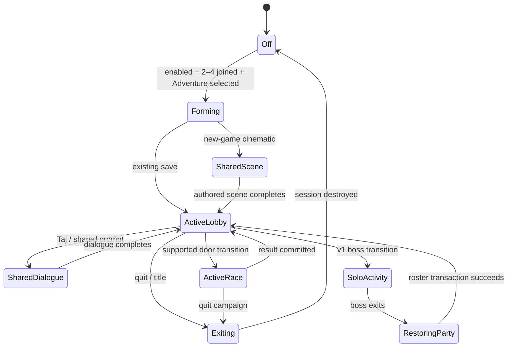

# Adventure Party — split-screen Adventure for two to four players

**Status:** implementation plan; no feature claims in this document are shipped
unless a gate is explicitly recorded as passing.

**Goal:** make two, three, or four local players able to enter Adventure together,
drive independently in every lobby, complete the campaign as one party, and keep
their controller and character identities throughout. The result should feel like
an authored Diddy Kong Racing mode, while the one-player campaign, retail
`JOINTVENTURE`, Tracks mode, online authority, save format, and matching N64 path
remain unchanged.

This is a **zero-regression target**, not a promise that software work has literal
zero risk. The design gets as close as engineering can: the new behavior is
dormant unless Adventure Party is explicitly active, most policy is isolated in
ROM-free native modules, the few game call sites are narrow `#ifdef NATIVE_PORT`
adapters, and every compatibility claim has both a gate and a positive control.

## Executive decision

Do not stretch the retail two-player Adventure globals into supporting four
players. They encode a turn-taking design: one player drives the lobby, two play
supported races, and the winner may become the next lobby driver. Extending those
binary swaps would make controller ownership, save ownership, cutscenes, and
progression increasingly fragile.

Build **Adventure Party** as a separate native session policy:

- two to four local participants are live at the same time;
- controller seat, character identity, and racer identity never swap;
- player one is the host and owns the shared save and shared menu decisions;
- every participant gets a racer and viewport in lobbies and supported races;
- campaign rewards are committed exactly once to the host save when the party
  satisfies the authored win condition;
- shared activities temporarily present as one authored full-screen scene, then
  restore the same party;
- unsupported v1 boss races are host-solo, with the party restored immediately
  on return to the lobby;
- four-racer special challenges use the same host-solo suspension envelope in
  the safe v1; genuine team versions graduate separately after their rules and
  opponent capacity are proven;
- no Adventure Party state is added to EEPROM or the retail `Settings` layout;
- existing one-player Adventure and retail `JOINTVENTURE` do not enter this code.

The native layer owns **session facts and policy**. The game remains the authority
for physics, objects, level scripts, authored requirements, race results, and save
writes. Adventure Party decides how many local humans participate, who may
initiate a shared action, and when a shared result may be committed; it does not
fork the campaign.

## What “always part of the game” means

Native feel is a product requirement, not a polish task at the end:

1. Players join through the existing character-select flow.
2. Game Select and file selection use the existing menu, typography, cursor,
   sounds, fades, and save-slot cards.
3. No launcher, debug prompt, room code, or networking vocabulary appears after
   the feature is activated.
4. Every hub racer handles exactly like the same character and vehicle in the
   one-player campaign.
5. Existing doors, balloons, keys, Taj dialogue, race intros, win sequences, and
   world transitions remain the visible experience. Party policy only resolves
   ownership around them.
6. Three-player layout keeps the established fourth-quadrant minimap behavior;
   two- and four-player layouts reuse established split-screen composition.
7. Full-screen authored moments fade in and out through existing transitions.
   The party never visibly disappears because an implementation rebuilds it.
8. Any new host marker or reconnect prompt uses existing HUD sprites, fonts,
   colors, and audio. If testing shows it is unnecessary, it is not added.

### Recommended activation

Add `Enhancements.AdventureParty` as a **gameplay-class** enhancement with the
player-facing label **Adventure Party** and help text such as “Lets two to four
local players explore and race together in Adventure.” It is off throughout
development and initial qualification. When on, a two-to-four-player character
selection may take the ordinary Game Select → Adventure → File Select route.

This is the safest activation seam because it gives the old behavior an exact off
path and makes the authority change explicit in the existing enhancement
registry. It is not an excuse for an app-like in-game experience: once enabled,
all interaction is through the game’s own menus.

The v1 default remains **off**. This is a discoverable opt-in, not a hidden
environment flag, but it preserves an unambiguous retail path. With the option
off, `JOINTVENTURE` behaves exactly as it does now. With Adventure Party on, the
explicit setting owns Adventure admission for two to four players; enabling the
magic code as well does not add lead swapping or otherwise layer the two modes.
The UI help must state that precedence so the combination is not surprising.

The enhancement-authority gate (`tests/check_enhancement_authority.py`)
enumerates the registry from the running binary (`MDKR_ENH_DUMP_TABLE=1`), flips
each row to its registry-owned `probe_value`, and compares one solo time-trial
fixture on the simulation hash. Adventure Party must correctly be inert in that
fixture, so adding a Python special case would either fail incorrectly or grow
the test-local `EFFECT_GATES` map, which can already drift from the registry.
Extend `MdkrEnhancement` with a small registry-owned proof profile next to
`probe_value` (for example, `SOLO_RACE` and `ADVENTURE_PARTY_3P`) and dump it
with the row. The gate dispatches from that field; the Adventure Party profile
runs an actual three-player admission/race route and compares off, on, and
compiled-out arms. Because the dump-format change touches every existing row,
current rows migrate to a default `SOLO_RACE` profile that reproduces today's
fixture behavior exactly, in the same commit, with the authority gate green for
every pre-existing enhancement before the new row lands. Add a gameplay/multiplayer UI category rather than
mislabelling the row as difficulty or cosmetic.

## Product contract

The following decisions are the v1 contract. Changing one requires updating its
test oracle before implementation.

| Area | v1 behavior |
|---|---|
| Party size | Two, three, or four local controllers; fixed from file entry until returning to title |
| Identity | Stable physical controller → player seat → selected character mapping; no lead swaps |
| Save | One shared retail Adventure or Adventure Two save owned by player one |
| Lobby | Every participant drives independently in split screen |
| Menus | Player one confirms shared file, pause, dialogue, and quit decisions; all players may cancel their own pre-session character selection |
| Doors/exits | Any participant may satisfy proximity/entry; the first valid trigger commits one whole-party transition |
| Collectibles | Any participant may collect shared golden balloons in lobbies and hidden keys inside their courses; the retail save receives one award |
| Vehicles | The lobby has one shared vehicle type; Taj transforms the whole party transactionally |
| Standard races | Every participant is human; the party wins when any human finishes first |
| Standard race field | Six total racers: 2/3/4 humans plus 4/3/2 CPUs; this is a release prerequisite, because a humans-only field would award a co-op win automatically |
| Silver coins | Team-shared: any human may collect a coin, all viewports see it disappear, the party needs eight total and a human win |
| Four-racer special challenges | Host-solo in the safe v1, with exact party restoration; team Taj/battle/egg/banana variants are follow-on capabilities, never humans-only automatic wins |
| Cutscenes/dialogue | One shared full-screen authored scene controlled by the host; original split layout and roster return afterward |
| Audio | Reuse the established multi-viewport race mix; shared pickups, doors, and dialogue play one party-wide cue; no per-seat audio channels in v1 |
| Bosses | Host-solo in v1; party state is suspended, not destroyed, and is restored in the destination lobby |
| Disconnect | Pause and request the missing controller; no mid-session hot join, drop, or AI substitution in v1 |
| Online | Out of scope; Adventure Party is local-only and never changes online player authority |
| Persistence | No party/session data in EEPROM; ordinary campaign progress persists exactly as retail progress does |
| Native save states | Unavailable while a party session is active in v1, with an existing-style explanatory prompt; serialization requires a later native sidecar contract |

Adventure Two uses the same party policy and its existing save flag, mirrored
tracks, coin object set, and progression rules. It is a required matrix arm, not a
separate implementation.

## Explicit non-goals

- Online, LAN, rollback, or Phone Party Adventure.
- A second campaign save, per-player campaign saves, or reward fan-out.
- Hot join/dropout after the file has been entered.
- Four independent pause menus or concurrent dialogue choices.
- Reauthoring lobby geometry, door placement, cutscenes, or ROM assets.
- Persisting a party midway through a lobby or race.
- Full multiplayer boss AI in v1.
- Per-player silver-coin copies in v1. The engine exposes only player-one and
  player-two invisibility flags, and viewports three/four alias those bits.
- Refactoring every legacy player-count branch before the feature works. The
  implementation replaces only branches inside the measured Adventure Party
  behavior class and mechanically inventories the rest.

## Compatibility invariants

These are release blockers, not aspirations.

### Source and binary boundaries

- Matching game logic remains untouched outside `#ifdef NATIVE_PORT`.
- With `Enhancements.AdventureParty=0`, the new module must not alter input,
  globals, settings rows, object admission, camera layout, RNG, save writes,
  state hashes, or pixels on established fixtures.
- A `MDKR_ADVENTURE_PARTY_OMIT` qualification build compiles every production
  effect/call site out while retaining the registry/schema plumbing. The ordinary
  off arm must match that build on the established authority fixtures.
- One-player Adventure and retail `JOINTVENTURE` never create an Adventure Party
  session. Their current traces, state hashes, save bytes, and representative
  screenshots remain the baseline.
- `platform/mdkr_adventure.*` remains test-hook infrastructure. Production party
  state and behavior must not be placed in it.
- `platform/party/` remains Phone Party/online-controller infrastructure. The
  Adventure feature must not reuse that name or its endpoint/session semantics.
- `mdkr_authoritative_player_count()` remains the online-authority boundary. A
  local Adventure participant count is not passed into it as party state and its
  output is not used to infer an Adventure party.
- Adventure Party never sets `gIsInTwoPlayerAdventure`, `gTwoPlayerAdvRace`, or
  the `CHEAT_TWO_PLAYER_ADVENTURE` flag. Every retail two-player-adventure
  branch — lead swaps (including the boss-vehicle sites in
  `vehicle_tricky.c:220,379`), the six-racer rule, player-one vehicle forcing,
  coin ownership bits, and the sitting-out portrait — is therefore mechanically
  unreachable in a party session and needs no edit to stay safe. This is the
  invariant that keeps most retail call sites untouched; the AP-01 scanner
  enforces it.

### Data and lifecycle boundaries

- The retail `Settings`, racer records, save codec, and EEPROM format do not grow.
- Party session state is process-local, reset on title/file exit, and excluded
  from saves and save states until a separate compatibility design exists.
- Native save-state capture/restore must fail closed while a party is active. It
  may not capture only RDRAM and silently omit the native roster/generation state.
  `platform/save_state.*` is today the refusal-enumerating container only, so the
  guard is cheap: register a party-active refusal reason there and any future
  capture implementation inherits it.
- Stable seats are `0..participant_count-1`; host is seat `0` for the entire
  session. A race winner never changes controller mappings or swaps save rows.
- A level load either establishes the whole requested roster before the first
  playable tick or follows a tested fail-closed path. A partial party is never
  playable.
- A transition and a campaign award each have one authority and an exact-once
  token. Multiple racers cannot request duplicate level loads or save writes.
- Tracks mode, Trophy Race launched from Tracks, demos, time trial, and online
  play produce the same effective counts and object filters as before.

### Vocabulary boundary

Avoid the root cause of many multiplayer bugs: “player count” is not one fact.
Use distinct queries and never add a new ambiguous global.

| Fact | Meaning | Proposed query |
|---|---|---|
| Connected controllers | Devices currently available | existing input/platform API |
| Character-select seats | Players presently joined in the menu | existing menu data |
| Adventure participants | Stable session roster, two to four | `adventure_party_participant_count()` |
| Live human racers | Human racer objects expected in this activity | `adventure_party_activity_human_count()` |
| Viewports | Cameras rendered for this activity | `adventure_party_viewport_count()` |
| Total racers | Humans plus CPUs for this race | existing spawn policy, given an explicit party plan |
| Network authority players | Endpoint-visible authoritative racers | `mdkr_authoritative_player_count()` only |

No caller should infer one fact from another. In particular,
`gNumberOfActivePlayers` may remain part of the retail menu/load protocol, but it
is not the Adventure Party session store.

## Evidence from the current implementation

The existing game is not one flag away from this feature:

- `menu.c:9406-9463` routes three/four selected players directly to Tracks. The
  `JOINTVENTURE` offset (`CHEAT_TWO_PLAYER_ADVENTURE`, `menu.h:221`) can admit
  at most two to Game Select.
- `menu.c:10088-10103` aggregates File Select input only from player one and, in
  the two-player case, player two.
- `menu.c:10469-10477` records exactly two-player Adventure and then collapses
  `gNumberOfActivePlayers` to one before campaign load.
- `menu.c:16546-16553` synthesizes a count of two only for default/challenge
  races, not lobbies or bosses.
- `game.c:824-833` and `objects.c:2715-2722` special-case the two-player race
  flag and viewport layout.
- `objects.c:2731-2748` already has a useful generic three/four-player spawn path,
  but it uses humans only, bosses force one human, and two-player Adventure has
  its own six-racer rule. Party standard races must safely combine four viewports
  with CPUs instead of treating the generic path as the finished behavior.
- The same block forces challenge races to four total racers. Inserting four
  humans would remove all opposition; increasing the field changes challenge
  object, scoring, AI, HUD, and finish assumptions. The safe v1 therefore
  suspends/restores the party around these activities just as it does for bosses.
- `objects.c:2842-2846` forces two-player Adventure racers through player one's
  vehicle selection.
- `objects.c:2970-2978` removes every `OBJECT_HEADER_NO_MULTIPLATER` object when
  two or more humans load. Every lobby therefore needs an object census before a
  blanket multiplayer count is safe.
- `game_ui.c:2729-2750` draws the lobby HUD only in the one-player layout and
  treats player two as a sitting-out portrait.
- `joypad.c:196-204` and `thread3_main.c:2122-2147` implement two-player Adventure
  leadership by swapping controller IDs and two save racer rows. Party mode must
  bypass, not generalize, that mechanism.
- `object_functions.c:2975-3031` binds Taj interaction, input, and fog to player
  one, and the scene camera follows through those player-one indices.
  `objects.c:3286-3340` rebuilds a transformed roster as exactly one racer.
- `object_functions.c:3831-3850` permits only player one to collect a hub golden
  balloon. Doors and exits are more naturally multi-racer but can currently
  produce independent/conflicting transition requests.
- `object_functions.c:4961-4984` encodes two-player silver-coin ownership with
  shifted action and invisibility bits. `tracks.c:3200-3201` and
  `tracks.c:4041` map viewport visibility with `viewport & 1`, so it cannot
  represent four independent coin copies.
- Race completion and post-race flow contain explicit player-one/player-two and
  lead-swap behavior in `objects.c`, `game_ui.c`, and `menu.c`, and the boss
  vehicle code swaps the lead on warp-out and defeat
  (`vehicle_tricky.c:220,379`); those sites need one party-policy answer rather
  than more count comparisons. Because they all guard on the retail two-player
  globals that a party session never sets, they stay inert without edits.

The foundation is nevertheless strong. `tests/check_race_multiplayer.py` already
drives player-three/player-four bindings, three- and four-camera layouts, the
three-player minimap quadrant, results, visible pixels in each viewport, and
positive controls. The current retail path is also executable:
`tests/check_taj_p2_adventure.py` enters `JOINTVENTURE` through the Magic Codes
UI and validates the established two-player behavior. These become immutable
regression anchors.

## Architecture

### New production modules

Create a purpose-named directory, separate from the game, online party code, and
Adventure test hooks:

```text
platform/adventure_party/
  adventure_party_state.h/.c       session state machine and exact-once tokens
  adventure_party_policy.h/.c      pure activity/count/authority decisions
  adventure_party_spawn.h/.c       deterministic formation candidate planner
  adventure_party_visibility.h/.c  native per-viewport policy if later required
tests/
  test_adventure_party_state.c
  test_adventure_party_policy.c
  test_adventure_party_spawn.c
```

`state`, `policy`, and `spawn` accept small value structs and return value structs.
They do not include game object layouts, hold `Object *`/`Settings *`, call the
renderer, write saves, or read controller globals. This makes their edge cases
ROM-free, fuzzable, and independently reviewable.

`visibility` is deferred unless a campaign activity truly needs per-viewport
admission. Team-shared silver coins do not need it. Do not build infrastructure
solely because it might be useful in a later version.

### Narrow game adapters

Game code may ask the module questions only at explicit lifecycle seams:

| Seam | Game responsibility | Party responsibility |
|---|---|---|
| Character select completes | Supply joined seats/characters | Decide whether a party may form |
| File entry commits | Load the chosen retail save | Create stable session and generation |
| Level request | Supply course, race type, entrance, authored vehicle | Return activity plan and capability |
| Racer setup | Spawn normal racer objects | Return human count, viewports, vehicle and formation candidates |
| Object admission | Apply ordinary filters | Return only measured party exceptions |
| Shared interaction | Detect authored collision/input | Arbitrate initiator and latch one transition/dialogue |
| Finish evaluation | Compute normal positions/coins | Return team success and an award token |
| Progress commit | Call existing retail flag/balloon/save code once | Consume the exact-once token |
| Level exit/title | Tear down normal level | Suspend, restore, or destroy session explicitly |

Every adapter is `#ifdef NATIVE_PORT`, checks `adventure_party_is_active()` first,
and has an immediate stock `else` path. Prefer replacing a condition with a named
query over copying a retail function into the native layer.

### State machine



Suggested state values are `OFF`, `FORMING`, `SHARED_SCENE`, `ACTIVE_LOBBY`,
`SHARED_DIALOGUE`, `ACTIVE_RACE`, `SOLO_ACTIVITY`, `RESTORING_PARTY`, and
`EXITING`. The session also owns:

- participant count and active-seat mask;
- stable character/virtual-racer identities by seat;
- host seat (`0` in v1);
- monotonically increasing session and level generations;
- current activity capability and roster plan;
- one latched shared action per level generation;
- consumed completion tokens;
- suspended roster facts needed to restore after a solo/shared activity.

Illegal events return a typed error and do not mutate state. Starting a second
transition, committing a stale generation, awarding twice, restoring a different
roster, or changing participant count mid-session are unit-test failures.

### Activity capability table

Do not equate a `race_type` with a complete product rule. Resolve a capability at
level request time and make unclassified activities fail closed.

| Activity | v1 presentation | Humans | Progress policy |
|---|---:|---:|---|
| Central/world lobbies | 2/3/4 split | all | shared lobby state |
| Default balloon race | 2/3/4 split | all, six racers total | any human first |
| Silver-coin race | 2/3/4 split | all, six racers total | eight team coins + any human first |
| Taj vehicle challenge | one viewport in safe v1 | host only | existing challenge progression once |
| Battle challenge | one viewport in safe v1 | host only | existing challenge progression once |
| Egg challenge | one viewport in safe v1 | host only | existing challenge progression once |
| Banana challenge | one viewport in safe v1 | host only | existing challenge progression once |
| Trophy series entered from Adventure | split | all | existing series state, one shared result |
| Boss race | one viewport | host only | existing boss progression once |
| New-game/world cutscene | one viewport | no live party input | existing cutscene flags once |
| Taj dialogue/transform | one authored view, then split | host controls; whole roster transforms | no extra persistence |
| Tracks/time trial/demo | unchanged | unchanged | party policy not active |

An activity remains disabled until its row has a fixture, a positive control, and
a recorded object-admission census. Unknown/custom levels fall back to host-only
with a visible development diagnostic; they must not guess that four-player is
safe.

The trophy row deliberately does not assert a field size. AP-04 must first
measure whether the retail trophy field is viable with four viewports; AP-16
owns the resulting decision before any trophy fixture is authored, and until
then trophy rows fail closed like any unproven activity.

### Deterministic transition arbitration

Each authored trigger reports a value event containing level generation, trigger
kind, destination, entrance, object identity, initiating seat, and simulation
tick. The reducer accepts only the first valid request. If multiple requests occur
on the same tick, the lower stable seat wins; object iteration order is not an
authority rule.

Once latched:

1. the existing trigger animation/fade begins for the initiator;
2. party control is locked only when the authored transition normally locks it;
3. one destination request is published;
4. additional door/exit/balloon requests are ignored for that generation;
5. destination spawn restores the full roster in a deterministic formation.

This prevents split players from entering different doors, double-incrementing a
load timer, or seeing an implementation teleport before the game fades.

### Transactional roster and formation spawning

Player one uses the authored setup point. Additional players are placed using a
pure ordered candidate plan relative to the authored heading: side-by-side first,
then staggered rear positions, then bounded fallback rings. The game adapter
projects candidates to ground and rejects geometry, water incompatibility,
object overlap, and invalid nav/collision positions with existing collision
queries.

The transaction is:

1. compute the full requested plan without mutating live racer arrays;
2. validate all required objects/capacities and all spawn positions;
3. build racers with stable seat and character identity;
4. publish racer arrays, camera count, and HUD count together;
5. increment the roster generation and enter the playable state.

If validation fails, never publish a partial roster. In development, stop before
the first playable tick with a precise diagnostic. The public fail-closed policy
is host-only for that unsupported activity, with an authored fade and a one-time
message; it may not silently drop a player in an activity declared party-safe.

### Exact-once progression

The existing finish code remains the only place that determines placements and
writes normal course progress. Party policy supplies:

- whether the activity's team condition has been satisfied;
- which existing progression action is permitted;
- an in-memory token keyed by session generation, level generation, course,
  activity, and completion kind.

The adapter consumes that token around the smallest existing retail commit. A
second call is a no-op with a diagnostic. Quitting, retrying, cutscene re-entry,
or simultaneous human finishes cannot duplicate balloons, amulets, trophies, or
course flags. Save bytes are compared against the equivalent one-player win
fixture, except for expected character/race-position fields already written by
retail multiplayer behavior.

### Shared interactions

- **Doors/exits:** any participant may initiate; one arbiter owns the transition.
- **Golden balloons/keys:** any non-CPU participant may collect — golden
  balloons in lobbies, hidden keys inside their courses during a standard race;
  the normal host save mutation runs once; pickup effects appear at the
  collecting racer.
- **Taj:** nearest eligible participant may summon him, but player one owns the
  shared dialogue choices. Camera/fog are applied to the shared scene, not hard
  coded to viewport zero. Transform frees/builds the whole roster atomically and
  returns to the same split layout.
- **Pause/quit:** Start from any seat may request pause; player one owns choices
  that mutate the shared session. The initiating viewport may provide the sound/
  visual acknowledgement, but there is only one pause state.
- **Silver coins:** collection increments one team counter. The coin becomes
  invisible to all viewports and cannot be collected again. Each HUD shows the
  same total. This avoids pretending the two existing visibility bits represent
  four independent worlds.

## Delivery strategy

The work is deliberately front-loaded with boundaries, pure policy, and gates.
Game call sites land only after their decision APIs and failure tests are frozen.

### Parallel waves and merge order

```text
Wave A (parallel foundations)
  A1 contract + source-boundary scanner                AP-00, AP-01
  A2 state/policy core + ROM-free model tests          AP-02, AP-03
  A3 trace schema + test-route skeletons               AP-05
  A4 lobby object/count census + performance baseline  AP-04
                         |
                         v
Wave B (parallel behind frozen APIs)
  B1 menu/admission UX          [menu ownership]        AP-06 (menu half)
  B2 spawn/formation planner    [new module only]       AP-07
  B3 transition reducer         [new module only]       AP-09 (pure half)
  B4 progression reducer        [new module only]       AP-13 (pure half)
  B5 harness/oracles            [tests/hooks ownership] Tier-2 skeletons
                         |
                         v
Wave C (serialized integration at hot files)
  C1 session creation (AP-06) -> C2 hub roster/camera/HUD (AP-08)
    -> C3 interactions/transitions (AP-09/10) -> C4 races/results (AP-12/13)
    -> C5 Taj/shared scenes (AP-11) -> C6 challenge/boss envelopes (AP-15/17)
                         |
                         v
Wave D (parallel campaign breadth after seams are stable)
  D1 lobby/collectible sweep (AP-18 arm)  D2 silver/default races (AP-14, AP-18 arm)
  D3 challenge sweep (AP-15 breadth)      D4 Adventure Two + trophy sweep (AP-16)
                         |
                         v
Wave E qualification (AP-19 -> AP-22)
  compatibility -> determinism -> performance -> platform matrix -> human feel
```

Wave C is intentionally serialized. `menu.c`, `objects.c`, `game_ui.c`, and
`object_functions.c` are high-conflict authority files; parallel edits there
would trade calendar time for integration risk. Parallelism happens in isolated
modules, fixtures, activity sweeps, and platform qualification.

### File ownership while work is active

| Workstream | Exclusive primary ownership | Must coordinate before touching |
|---|---|---|
| Core policy | `platform/adventure_party/**`, ROM-free tests | enhancement/config schema |
| Admission/UX | `menu.c`, menu adapter/header, enhancement row | save/file-select and character mods |
| Roster/render | `objects.c`, `game_ui.c`, camera/layout adapter | interaction and results workstreams |
| Interactions | `object_functions.c`, transition adapter | roster transforms and campaign fixtures |
| Results/save | finish/result adapters in `objects.c`, `menu.c`, `game_ui.c` | any concurrent owner of those files |
| Test systems | new `tests/check_adventure_party_*.py`, input scripts | `platform/mdkr_adventure.*` hook changes |
| Qualification | evidence and platform routes | no production ownership |

One integration owner queues the hot-file adapters. Each commit must compile and
pass its own off-path regression set before the next adapter lands. Never batch
menu admission, spawning, progression, and campaign breadth into one change.

## Implementation backlog

Sizes are relative engineering sizes after the current source investigation, not
calendar promises. Every ticket includes its test and positive control.

| ID | Size | Depends | Deliverable and exit gate |
|---|---:|---|---|
| AP-00 Contract freeze | S | — | Approve this product/capability table, activation, boss, coin, and six-racer field semantics; no code |
| AP-01 Boundary inventory | M | AP-00 | Machine-readable inventory of Adventure count/lead branches and a scanner that rejects new unclassified exact-count logic |
| AP-02 Core state | M | AP-00 | Session reducer, legal transitions, generations, stable roster; ROM-free tests and mutation controls; `MDKR_ADVENTURE_PARTY_OMIT` build arm exists from the first module commit |
| AP-03 Policy core | M | AP-02 | Activity plans, count vocabulary, host/action authority, fail-closed classification; table-driven tests |
| AP-04 Baseline/capacity census | M | AP-00 | All lobby/activity object removals, six-racer-with-four-viewports capacity, camera/resource high-water and current save/hash baselines recorded; capacity is measured with dev-only forced-count spawns through the existing test-hook layer, since production party spawning does not exist yet; a failed budget returns the field-size decision to AP-00, it is not improvised |
| AP-05 Instrumentation | M | AP-02 | Read-only traces for session, roster, controller binding, transition, interaction, award, layout, and restore generations |
| AP-06 Activation/admission | M | AP-03 | Gameplay enhancement/category/proof profile plus normal Character Select → Game Select → File Select route for 2–4; off/compiled-out paths byte-identical; party-active save-state refusal registered in `platform/save_state.*` with its existing-style prompt |
| AP-07 Formation planner | M | AP-03, AP-04 | Pure candidate planner and collision-validating adapter; deterministic all-hub fixtures |
| AP-08 Lobby roster | L | AP-05–07 | Atomic 2/3/4 racer spawn, viewport layout, per-seat input and HUD in one representative lobby; fixtures use existing-save files until AP-11 delivers the new-game shared-scene envelope |
| AP-09 Transition arbiter | M | AP-02, AP-05 | Simultaneous/conflicting doors/exits reduce to one authored transition |
| AP-10 Lobby interactions | L | AP-08, AP-09 | Doors, exits, key-locked doors, balloons, teleporters, pause, quit, and controller-disconnect pause/reconnect use shared authority in representative lobby |
| AP-11 Taj/shared scenes | L | AP-08–10 | Nearest summon, host dialogue, party-wide transform, camera/fog, roster restoration; owns the `SHARED_SCENE` envelope used by new-game and world cutscenes |
| AP-12 Default races | L | AP-08, AP-09 | 2/3/4 start, input, camera/HUD, field rule, results, retry, and lobby return; race entry is a party transition, so the arbiter is a dependency |
| AP-13 Progress exact-once | L | AP-03, AP-05, AP-12 | Any-human win, and hidden course keys collected by any human, each map to one existing retail commit; losing/quit/retry and simultaneous finishes cannot award |
| AP-14 Silver coins | L | AP-10, AP-13 | Shared count/visibility/HUD, eight-plus-win rule, replay behavior, save equivalence |
| AP-15 Challenge envelope | M | AP-09, AP-13 | Host-solo Taj/battle/egg/banana entry, progress, exit, and exact party restoration; no humans-only automatic win |
| AP-16 Trophy/Adv Two | L | AP-12–14 | Series lifecycle and mirrored/alternate coin campaign matrix preserve party identity/progress |
| AP-17 Boss envelope | M | AP-09, AP-13 | Host-solo transition, boss result, cutscene, and exact party restoration for first/rematch bosses |
| AP-18 Campaign sweep | XL | AP-10–17 | Every lobby, door class, world transition, course, vehicle, and campaign branch classified and routed |
| AP-19 Resource/performance | M | AP-08, AP-18 | Four-camera budgets, repeated-transition plateau, object/display-list capacity, no deadline misses |
| AP-20 Platform matrix | L | AP-18, AP-19 | Supported OS/renderer/build/region/input combinations meet tiered gates |
| AP-21 Native-feel pass | M | AP-18 | Blind human sessions, navigation/readability/audio/camera rubric; only measured polish changes land |
| AP-22 Release/rollback | S | AP-19–21 | Kill switch, docs, known limits, clean save migration story, GO review and evidence manifest |

### Critical path and estimate

The likely v1 critical path is AP-00 → AP-02/03 → AP-06 → AP-08 → AP-10/12
→ AP-11/13 → AP-14/15/17 → AP-18 → qualification. AP-11 sits on the path
because the campaign sweep cannot route most of the campaign without Taj
vehicle transforms. With one integration owner and
parallel policy/test/activity work, a credible engineering range is **6–9 engineer
weeks** for split lobbies, 2–4-player standard and silver-coin races, shared
progression, and safe host-solo challenge/boss envelopes. Campaign surprises
found by AP-04/AP-18 can move that range.

Genuine team variants of all four special challenges are an estimated **3–5
engineer-week** follow-on after their design spikes. True multiplayer boss races,
independent per-player silver coins, and hot join/dropout add another **4–6+
engineer weeks** and are not hidden contingency inside v1.

## Validation architecture

Tests must prove behavior, compatibility, and that the proof can detect the bug.
Every headless game invocation uses `MDKR_AUDIO=0`.

### Tier 0 — static/source boundary

- Matching source changes are inside `#ifdef NATIVE_PORT`.
- New production code does not enter `platform/mdkr_adventure.*` or
  `platform/party/`.
- A branch inventory classifies every use of `is_in_two_player_adventure`,
  `race_is_adventure_2P`, lead swap, and relevant exact player-count comparison.
- The scanner fails on a newly introduced ambiguous `party player count` global,
  direct party use of `mdkr_authoritative_player_count()`, an unclassified
  Adventure exact-count branch, or any party-path write to
  `gIsInTwoPlayerAdventure`/`gTwoPlayerAdvRace`/`CHEAT_TWO_PLAYER_ADVENTURE`.
- New enhancement key, schema, registry row, UI routing, default, probe value, and
  gameplay authority class agree. Its registry-owned proof profile selects the
  party fixture; the Python gate contains no separate key list.

**Positive controls:** add one unguarded matching-source edit; place a production
symbol in the test-hook file; introduce an unclassified `== 2` party branch; mark
Adventure Party as presentation; assign its proof profile to the solo fixture.
Each corresponding gate must fail.

### Tier 1 — ROM-free model/unit tests

`test_adventure_party_state`, `test_adventure_party_policy`, and
`test_adventure_party_spawn` cover:

- every legal and illegal state/event pair;
- participant counts 0–5, sparse/duplicate masks, stable identity, and host rules;
- stale/wrong generations, duplicate transitions, simultaneous initiators, and
  deterministic tie-breaking;
- exact-once completion for every activity and failure/quit/retry sequences;
- activity classification and fail-closed unknowns;
- human/viewports/total-racer counts never being substituted for one another;
- formation symmetry, deterministic ordering, bounded fallback, and failure to
  publish an incomplete roster;
- property/fuzz sequences that reset, suspend, restore, and exit at every event.

**Positive controls:** remove the duplicate-award guard, accept a stale
generation, swap a seat during restore, return four viewports for a solo boss,
and duplicate a spawn candidate. The suite must fail the named invariant.

### Tier 2 — focused ROM-backed feature gates

Add small routes with one semantic owner each:

| Gate | Proves |
|---|---|
| `check_adventure_party_admission.py` | 2/3/4 reach ordinary Adventure file flow only when enabled; 1P/retail paths unchanged |
| `check_adventure_party_binding.py` | each physical controller moves only its stable selected racer before/after race, cutscene, transform, retry, and restore |
| `check_adventure_party_hub.py` | 2/3/4 racers, valid formations, populated viewports/HUD, independent movement |
| `check_adventure_party_object_census.py` | required doors, Taj, balloons, keys, exits, triggers, and lobby systems survive multiplayer filtering |
| `check_adventure_party_transition.py` | every trigger class performs exactly one whole-party load under simultaneous/conflicting entry |
| `check_adventure_party_taj.py` | summon ownership, shared dialogue, vehicle transform, camera/fog and roster restoration |
| `check_adventure_party_race_loop.py` | course entry, all bindings/viewports, winner permutations, loss, retry, quit, and same-party lobby return |
| `check_adventure_party_progress.py` | one equivalent save mutation for P1/P2/P3/P4 wins and none for losses/quit/duplicates; the mutated save then loads and resumes correctly in one-player Adventure |
| `check_adventure_party_silver.py` | one shared eight-coin tally/visibility plus win, replay state, Adventure Two objects |
| `check_adventure_party_challenges.py` | safe-v1 host-solo challenge suspension, completion/defeat, and exact party restoration |
| `check_adventure_party_boss_restore.py` | host-solo boss, exact-once award/cutscene, identical roster/layout restored |
| `check_adventure_party_save_state.py` | active party capture/restore is clearly blocked; normal save states and retail campaign saves remain available |
| `check_adventure_party_campaign.py` | full world/course/vehicle transition manifest and no unclassified activity |
| `check_adventure_party_resources.py` | stable high-water marks across repeated lobby/race/Taj/boss cycles |

The tests consume traces from the running binary and inspect authoritative facts,
save bytes, state hashes, and pixels where each is appropriate. They do not infer
gameplay success from “process did not crash.”

Required positive controls include:

- clamp admission back to two;
- bind player three to player one's controller;
- collapse the roster to one after file entry or Taj transform;
- blank one viewport or move the three-player minimap;
- restore a different character/vehicle/seat;
- let two doors publish transitions in one generation;
- restrict a lobby balloon to player one;
- delete one measured `NO_MULTIPLAYER` admission exception;
- make a coin remain visible/collectible in one viewport;
- award a balloon/course flag twice;
- return from a boss with one racer.

Each mutation must make the intended gate fail for the intended reason.

### Tier 3 — compatibility regression gates

At minimum, run the existing:

- `check_adventure_hub.py`
- `check_adventure_race_loop.py`
- `check_adventure_two.py`
- `check_taj_p2_adventure.py`
- `check_race_multiplayer.py`
- `check_campaign_progression.py`
- `check_first_boss_progression.py`
- `check_boss_win_verdict.py`
- `check_trophy_series.py`
- `check_save_failsafe.py`
- `check_determinism.py`
- `check_array_bounds_sweep.py`
- `check_2p_human_binding.py`
- `check_attract_demo.py`
- `check_network_viewport_invariance.py`

The last two anchor the stated demo and online-authority invariants directly;
without them those invariants would have no named gate. Time trial is anchored
by the enhancement-authority gate's solo time-trial fixture, which runs on
every registry change.

Add the ordinary two-player split-race, camera, save-codec/container, enhancement
registry/authority, and renderer state-hash groups selected by the touched files.
The off arm must be byte-identical where an existing deterministic oracle exists;
“same outcome” is insufficient for the compatibility claim.

### Tier 4 — matrix and cadence

Running the full Cartesian product on every commit is wasteful. Use layered
coverage:

| Cadence | Required matrix |
|---|---|
| Every core-policy PR | ROM-free tests, static boundary, formatter/build, positive control for changed invariant |
| Every adapter PR | focused route at 2/3/4, off arm, nearest retail regression gates, sanitizer build |
| Integration branch | all focused gates, all existing Adventure/4P gates, Adventure Two smoke, GL + WebGPU authority comparison, off-arm vs `MDKR_ADVENTURE_PARTY_OMIT` equivalence on the authority fixtures |
| Nightly | all lobbies/courses, 2/3/4, Adventure/Adventure Two, winner-seat rotation, repeated transitions, controller reconnect |
| Release candidate | supported OSes, renderers, US/PAL regions, Debug/Release/sanitizers, keyboard/gamepads, common aspect/window modes, full campaign soak |

Use pairwise selection for platform/input/display combinations during nightly
runs, then cover every supported cell before release. Authority hashes for the
same party script must agree across renderers, window sizes, and presentation
enhancements. Presentation changes may change pixels, never party authority.

### Performance and resource gates

AP-04 first records release-build baselines instead of inventing budgets after
implementation. Freeze budgets with explicit headroom before AP-08:

- no authored simulation deadline misses during four-camera lobby traversal;
- frame-time percentile budgets per supported renderer/platform, compared with
  established four-player races and the measured lobby baseline;
- object, racer, camera, HUD, audio voice, display-list, and texture high-water
  marks remain under real capacities;
- no monotonic growth over at least 20 hub → race → hub transitions, five Taj
  transformations, and repeated host-solo boss suspensions/restores;
- object/camera culling does not change authoritative simulation;
- reduced window size and three-player layout remain readable without changing
  the state stream.

Any budget increase requires a named capacity analysis. “It seemed smooth” does
not qualify four-camera hubs.

### Native-feel acceptance

Automated correctness is necessary but cannot judge whether the mode feels
authored. Run blind sessions with players who are not told the implementation:

1. form 2-, 3-, and 4-player parties from title;
2. choose/create a file, navigate a lobby, enter the wrong and right doors;
3. collect a shared item and complete/lose/retry a race with different winners;
4. invoke Taj, change vehicle, watch a cutscene, pause, and reconnect a controller;
5. complete a host-solo special challenge and boss, resuming together after each.

Record task completion, wrong turns, “who controls this?” questions, unreadable
HUD/camera events, transition surprises, and controller-identity mistakes. The
release gate is zero identity surprises or lost/duplicate progress, no unexplained
mode vocabulary, and no repeated navigation failure attributable to split-screen
presentation. Cosmetic changes require an observed issue and an off-path pixel
gate.

## Rollout and rollback

1. **Shadow:** module linked, option hidden/off, decisions traced but never
   applied. Compare predicted plans with stock one-/two-player runs.
2. **Developer:** explicit environment/config activation; one representative
   lobby and default race; no compatibility claims beyond passing evidence.
3. **Experimental:** visible gameplay enhancement, off by default; all v1
   activities classified, known host-solo challenge/boss message present.
4. **Candidate:** full platform/campaign matrix and human-feel gates; option
   remains off by default and is exercised explicitly in both arms.
5. **Qualified:** remove development diagnostics from player view, not the kill
   switch or traces needed by tests.

The rollback is `Enhancements.AdventureParty=0` before session creation — the
ordinary INI schema row in `platform/video_config.c`, with the registry's
`MDKR_ENH_*` environment override available for automation. Do not
switch the mode off mid-session: return safely to title first so no live roster is
reinterpreted. Because no party state enters EEPROM, a rolled-back build loads the
same retail campaign progress. A release may disable an activity capability
individually and route it host-solo without disabling already qualified lobbies
and races.

## Risk register

| Risk | Early signal | Mitigation / owner |
|---|---|---|
| Hidden exact-two logic | branch inventory or P3/P4 route diverges | AP-01 scanner; subsystem owner replaces with named policy query |
| Required lobby object filtered | object census differs at party count | AP-04/AP-10 explicit measured admission exceptions, never blanket filter removal |
| Controller/character identity swaps | binding generation or input witness changes | stable session seats; bypass lead swap; AP-02/AP-08 gates |
| Duplicate transition/progress | two tokens/loads/save deltas in one generation | pure arbiters and consume-once tokens; AP-09/AP-13 |
| Taj destroys roster | racer count/identity differs after transform | transactional rebuild and fail-before-publish; AP-11 |
| Four-camera resource overflow | high-water or frame percentile exceeds budget | baseline first, capability fallback, AP-04/AP-19 |
| Coin visibility aliases P3/P4 | viewport census disagrees | shared-team semantics v1; defer per-player sidecar |
| Boss vehicle/AI assumes P1 | non-host boss path touches P1-only code | host-solo envelope v1; separate boss project |
| Save or save-state incompatibility | byte/container gates change | session not persisted; existing commit code once; active-party save-state guard is mandatory in v1 |
| Online authority contamination | network hash/count changes with local option | separate count vocabulary and source scanner; online regression gates |
| Mod/custom level unknowns | unclassified activity requested | capability registry fails closed to host-only with diagnostic |
| Parallel merge conflict | multiple workstreams edit authority file | exclusive ownership and serialized Wave C integration |

## Definition of ready

Wave A foundation work may begin when:

- AP-00 decisions are accepted, especially activation, team coins, six-racer
  standard fields, safe challenge envelope, and host-solo bosses;
- current one-player, `JOINTVENTURE`, three/four-player race, save, hash, and
  representative pixel baselines are green and archived;
- each activity in the v1 table has an owner and planned fixture;
- each foundation ticket names its positive control and rollback.

Wave C game-file integration may begin only when:

- pure APIs, trace schema, count vocabulary, and hot-file ownership are frozen;
- AP-04 proves six racers with four viewports have safe capacities/budgets and
  the object census has no unexplained removal;
- the relevant focused route fails for its planned missing behavior and its
  positive control has been demonstrated;
- the adapter can land as an independently revertible commit with a complete
  stock/off path.

## Definition of done / GO criteria

Adventure Party v1 is done only when:

- two, three, and four players can form a party through the ordinary game flow;
- every participant's stable identity independently drives every Adventure lobby;
- all declared v1 activities complete, retry, quit, transition, and return with
  the same party;
- every human winner permutation produces exactly one correct retail progress
  mutation and defeat/quit produces none;
- every lobby/course/activity is classified; there is no accidental fallthrough;
- one-player Adventure, retail `JOINTVENTURE`, Tracks, online play, demos, save
  format, and matching N64 paths meet their stated unchanged evidence;
- all new and relevant existing gates pass in the release matrix;
- every gate's positive control has been observed failing;
- sanitizer, determinism, capacity, performance, repeated-transition, and save
  reload/rollback evidence is green;
- blind native-feel sessions meet the acceptance rubric;
- limitations say “special challenges and bosses are host-solo in v1” and no
  broader co-op claim is made;
- the evidence manifest records binary/ROM/config hashes, commands, artifacts,
  platforms, and verdicts.

## Follow-on: special-challenge co-op

Treat Taj, battle, egg, and banana challenges as four capabilities, not one
multiplayer flag. Each design spike must answer:

- the cooperative win/defeat condition and whether player-versus-player can still
  block campaign progress;
- how at least one meaningful AI opponent/target remains with four humans;
- whether the safe field is five, six, or more racers and which four-racer
  constants, object slots, HUD elements, scoring loops, and finish formulas move;
- team ownership of eggs, bananas, battle health, Taj targeting, audio, and
  cutscenes;
- exact-once mapping back to the unchanged retail challenge progress write;
- four-camera readability and resource budgets.

Graduate one activity only after its 2/3/4-player win, loss, tie, disconnect,
retry, save, and positive-control matrix is green. Until then, its host-solo
envelope remains a complete, native-feeling fallback. A credible combined range
for all four is **3–5 engineer weeks**, but the spikes own that estimate.

## Follow-on: full boss co-op

Treat multiplayer bosses as a new milestone after v1. Current setup forces one
human, boss vehicle code frequently targets player one, and camera/finish logic is
authored around a duel. Its Definition of Ready requires a per-boss target/attack
policy, multiplayer fail/win semantics, spawn/camera budgets, and a complete
player-one-assumption inventory. Do not weaken the safe v1 boss envelope to make
that future work appear smaller.

## Evidence record

When implementation starts, store qualification artifacts under the existing
topic-subdirectory convention — `docs/evidence/adventure-party/`, as
`docs/evidence/multiplayer/` does, with dated per-release records inside — and
link only summarized, reproducible verdicts from this document. Each record should include:

- source revision and dirty-state declaration;
- binary, ROM, save fixture, config, and input-script hashes;
- exact headless command and environment (`MDKR_AUDIO=0`);
- observed trace/schema version, save delta, state hash, and pixel artifact as
  applicable;
- positive-control mutation and the expected failure it produced;
- owner/date and PASS, FAIL, or NOT RUN.

Until those records exist, this document describes the intended architecture and
roadmap—not a shipped feature.
